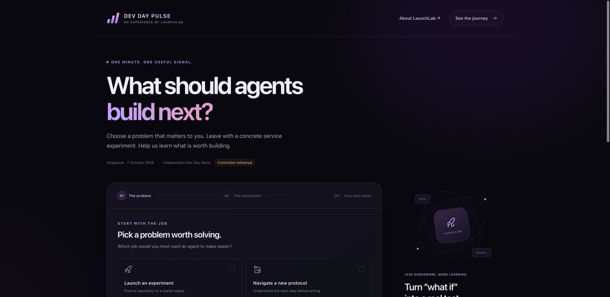

# Dev Day Pulse

**What should agents build next?** A one-minute attendee experience for the OKX Dev Day finale, and a fresh static repository to test LaunchLab's deployment and validation workflow.

An attendee chooses an agent job and audience, creates a service experiment card, gives a non-binding price preference, and copies or downloads the resulting brief. The card is generated from fixed local templates; this app does not call an LLM, connect a wallet, charge money or claim to execute the proposed service.



## Try it locally

Use Node 22.12 or newer:

```sh
npm ci --ignore-scripts
npm test
npm run build
npm run dev
```

Open <http://127.0.0.1:4417/>. For a clearly labelled controlled rehearsal, use <http://127.0.0.1:4417/?test=1>. Nothing is hosted or charged by these commands. There are no required environment variables, API keys or backend services.

## Try the LaunchLab flow

Start at [LaunchLab's walkthrough](https://launchlab.stardive.xyz/journey/#try-flow) or [the LaunchLab agent](https://www.okx.ai/agents/13905). Use an agent client with the official OKX AI skill installed and authenticated. See [the manual rehearsal](docs/MANUAL_TEST_TOMORROW.md) and [copyable request](docs/LAUNCHLAB_BRIEF.md).

This is a public Vite/npm frontend. The app is at the repository root, the build command is `npm run build`, and the output folder is `dist`. The included `amplify.yml` describes a static AWS Amplify build. LaunchLab's current managed pipeline builds a disposable source copy and adds approved instrumentation there; it does not need to commit tracking code to this repository.

The managed preview is password-protected by default. A public GitHub repo does not make the hosted preview publicly accessible. Use private preview access for the rehearsal. Before inviting attendees, separately agree the access mode and sharing plan; a public, unrestricted attendee URL is not prepared by this repository.

`launchlab.experiment.json` is advisory documentation. LaunchLab does **not** automatically import its event definitions. Include the definitions explicitly in the service request and review the collection plan before deployment.

The general repository inspector can suggest a Vercel recipe. That recipe is advisory and its adapter is not implemented. For this rehearsal, explicitly request LaunchLab's existing managed AWS CodeBuild/Amplify static adapter. Framework detection alone does not approve or start hosting.

For a manual Amplify deployment, connect this repository through the Amplify console, use the root app and included build settings, review the account and charges, then deploy. That is an alternative manual hosting route; it does not test the OKX agent handoff or install LaunchLab's hosted collector. No deployment is performed by this repository itself.

## What to validate

Question: can a first-time attendee create a useful agent service experiment without help?

| Event | Meaning |
| --- | --- |
| `mission_started` | Start button clicked; intent, not completion |
| `problem_selected` | Valid job and audience submitted |
| `brief_created` | A valid submission generated an experiment card; primary completion |
| `price_signal_submitted` | Price preference confirmed; includes free and is not a sale |
| `brief_copied` | Clipboard API write succeeded |
| `brief_exported` | JSON download requested; download completion is not proven |

The start button has an intent marker. Successful actions use the explicit adapter; the same event is not also marked on its button. Repeated successful generations count as multiple actions. Sessions are browser sessions, not unique people. A price preference is a stated opinion, not validated willingness to pay.

Suggested feedback: “Was the proposed experiment useful?”, “Would you actually try this service?”, and “What was unclear or missing?” Controlled rehearsals belong in the internal-test cohort. Never present your own actions as organic traction.

## Data and consent

- The product form stays in page memory until you choose copy or download. Those exports can contain your optional friction text; leave out secrets and personal information.
- Optional local observations record fixed event names, random session identifiers and timestamps. Local feedback stores your comment, rating and intent in this browser. Recording starts off on each page and never backfills prior actions.
- Feedback works while activity recording is off. Resubmitting within one page session updates that session's response. Reloading starts a new session; this is not a proof of one response per human.
- Local storage failures keep the controls usable in page memory. Clearing local observations does not delete a copied/downloaded file or data already sent to a hosted collector.
- When a real LaunchLab widget is mounted, it manages hosted consent and feedback. The app forwards only fixed event names to its configured SDK. An SDK stub alone does not hide the local feedback form.
- This standalone repo has no network collector or shared community results. Hosted collection becomes available only after LaunchLab deployment and an approved collection plan. Hosted report credentials must stay private.

## Evidence boundary

This repo is an experiment, not an official OKX product. It has no recruitment pool, real rewards, payouts, checkout, combined attendee leaderboard or autonomous agent execution. Creating an experiment card does not prove demand. The new OKX-to-deployment-to-feedback journey must be rehearsed before claiming it works for this app.

The marketplace fee, model conversations, backend planning, builds and hosting are separate costs. Approval of a service fee does not approve GPT usage or deployment. A preview persists until the operator removes it; an approval's expiry is not automatic site expiry.

See [the three-minute pitch](docs/THREE_MINUTE_DEMO.md) for a realistic live-demo sequence and fallback.

Local build and browser results are recorded in [verification](docs/VERIFICATION.md). A successful local test is not evidence of a fresh paid handoff or organic attendee demand.
